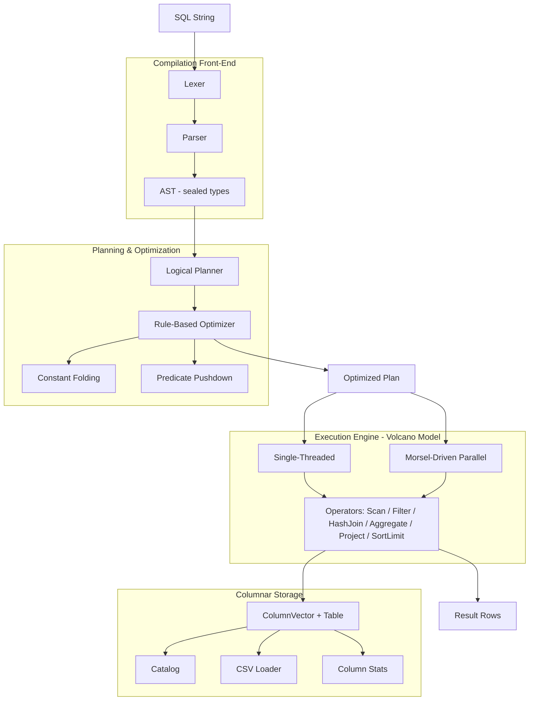
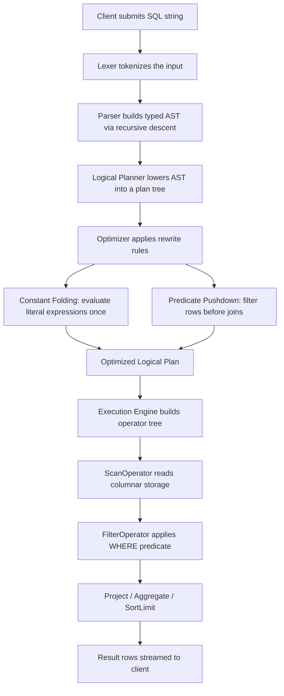
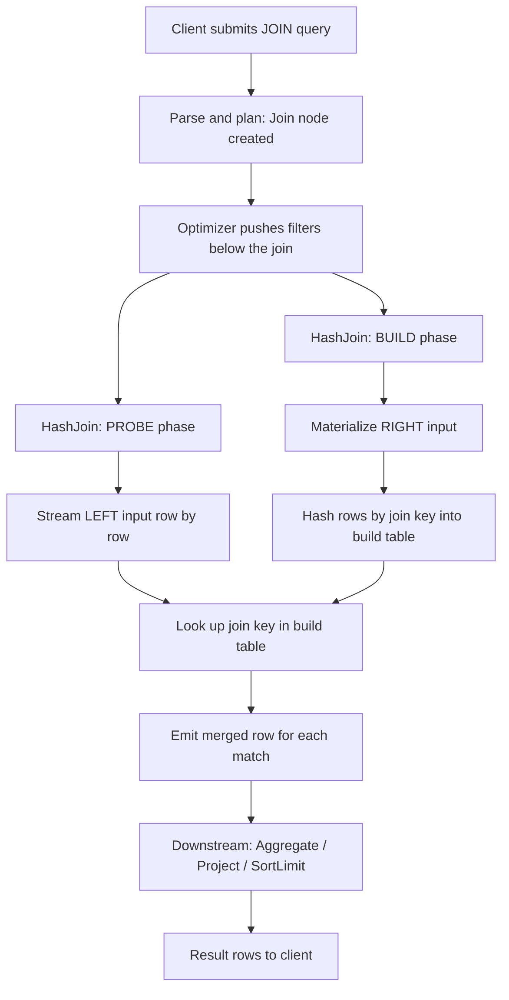
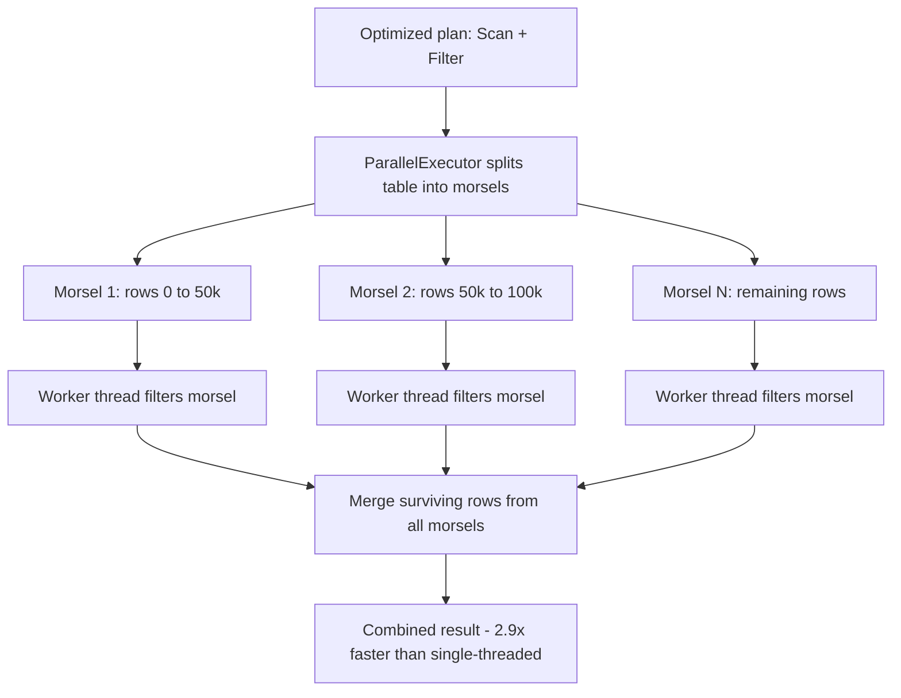

# Flurry — A Columnar SQL Query Engine in Java

**Flurry** is an analytical SQL query engine built from scratch in **Java 17**. It implements the complete query-compilation pipeline — lexing, parsing, logical planning, rule-based optimization, and **morsel-driven parallel execution** — over a **columnar storage** layer. It supports filters, joins, aggregations, sorting, and a plan optimizer, ships with an interactive SQL shell, and achieves a measured **2.9× speedup** through multi-threaded execution.

> 💡 **Built on top of Flurry:** Check out **[FlurryPilot](https://github.com/siriscen7/flurrypilot)**, an autonomous SQL query agent I built to interact with the engine using natural-language queries.

## Motivation

Modern analytical warehouses (Snowflake, BigQuery, Redshift) get their speed from principles that everyday database *use* never exposes:

- **Columnar storage** — read only the columns a query touches.
- **Query compilation & optimization** — turn declarative SQL into an optimized physical plan.
- **Parallel execution** — split a single query across CPU cores.

Flurry rebuilds this machinery from the ground up — a hand-written lexer/parser, a logical planner, a rule-based optimizer, and a parallel Volcano-model executor — to show exactly how a SQL string becomes optimized, parallelized work.

## Key Features

- **Full compilation pipeline** — hand-written lexer + recursive-descent parser → typed AST → logical plan → optimized plan.
- **Columnar storage** with typed column vectors, automatic type inference, and per-column min/max statistics.
- **Rich SQL support** — `SELECT`, `WHERE`, `JOIN ... ON`, `GROUP BY`, aggregates (`COUNT/SUM/AVG/MIN/MAX`), `ORDER BY`, `LIMIT`, arithmetic, qualified columns, aliases.
- **Rule-based optimizer** — constant folding and predicate pushdown, with an `EXPLAIN` command showing before/after plans.
- **HashJoin** — build/probe equi-join for multi-table queries.
- **Morsel-driven parallel execution** — intra-operator parallelism over a shared thread pool, **benchmarked at 2.9× over single-threaded** (JMH).
- **Interactive SQL shell** — a REPL with pretty-printed tables, query timing, and `EXPLAIN`.
- **SQL-correct null semantics** — nulls excluded from aggregates, treated as non-matching in comparisons.

## Architecture



## Request Flow

### Query Execution (single-table)



### Join Query (HashJoin)



### Parallel Execution (morsel-driven)



## Performance

Benchmarked with **JMH** on a 2,000,000-row scan + filter
(`SELECT name, age, salary FROM big WHERE age >= 40 AND salary > 100000`):

| Mode | Time per op | Speedup |
|---|---|---|
| Single-threaded | 346.7 ms ± 6.9 | 1.0× |
| Morsel-driven parallel | 120.5 ms ± 10.8 | **2.9×** |

*(Measured on Apple Silicon, 5 measurement iterations, shared thread pool.)*

The speedup is bounded by allocation/GC pressure (boxed values + per-row map construction) rather than CPU — which is precisely why production engines use primitive columnar vectors and batch-at-a-time execution.

## Interactive Shell

```
$ flurry shell users data/users.csv orders data/orders.csv

flurry> SELECT city, COUNT(*) AS n FROM users GROUP BY city;

+----------+---+
| city     | n |
+----------+---+
| San Jose | 2 |
| Seattle  | 1 |
| Austin   | 1 |
+----------+---+
3 rows (4 ms)

flurry> EXPLAIN SELECT name FROM users WHERE age > 20 + 10;

=== Logical Plan (optimized) ===
Project([name AS name])
  Filter[(age > 30)]
    Scan(users)
(planned in 1 ms)
```

## SQL Examples

```sql
SELECT name, age FROM users WHERE age >= 30 AND city = 'San Jose';
SELECT city, COUNT(*) AS n, AVG(age) AS avg_age FROM users GROUP BY city;
SELECT name, age FROM users ORDER BY age DESC LIMIT 2;
SELECT name, amount FROM users JOIN orders ON id = user_id;
SELECT name, SUM(amount) AS total FROM users JOIN orders ON id = user_id GROUP BY name;
```

## Project Structure

```
src/main/java/com/flurry/engine/
├── Main.java                    # CLI entry point
├── Shell.java                   # Interactive SQL shell
├── storage/                     # Columnar storage
│   ├── ColumnVector.java, Table.java, Schema.java
│   ├── Catalog.java, CsvLoader.java
│   ├── DataType.java, ColumnStats.java
├── parser/                      # Compilation front-end
│   ├── Lexer.java, Token.java, TokenType.java
│   ├── Parser.java, ParseException.java, LexException.java
│   └── ast/                     # AST nodes (sealed types + records)
│       ├── Expr.java, SelectStatement.java
│       ├── BinaryOp.java, UnaryOp.java
├── plan/                        # Logical plan
│   ├── LogicalPlan.java, LogicalPlanner.java
├── optimizer/                   # Rule-based optimizer
│   ├── Rule.java, Optimizer.java
│   ├── ConstantFolding.java, PredicatePushdown.java
├── execution/                   # Volcano execution engine
│   ├── Operator.java, Row.java, ExecutionEngine.java
│   ├── ScanOperator.java, FilterOperator.java, ProjectOperator.java
│   ├── AggregateOperator.java, Aggregator.java
│   ├── SortLimitOperator.java, HashJoinOperator.java
│   ├── ExpressionEvaluator.java, TablePrinter.java
│   └── ParallelExecutor.java    # Morsel-driven parallel execution
└── util/DataGen.java            # Benchmark data generator

src/jmh/java/com/flurry/engine/bench/ScanFilterBenchmark.java
src/test/java/com/flurry/engine/...
```

## Build & Run

### Prerequisites
- Java 17+ (developed on JDK 23)
- Gradle wrapper included (`./gradlew`)

### Commands
```bash
# Build & test
./gradlew build
./gradlew test

# Interactive shell (recommended)
./gradlew installDist
./build/install/flurry/bin/flurry shell users data/users.csv orders data/orders.csv

# One-shot queries
./gradlew run --args='query users data/users.csv "SELECT city, COUNT(*) AS n FROM users GROUP BY city"'
./gradlew run --args='query2 users data/users.csv orders data/orders.csv "SELECT name, amount FROM users JOIN orders ON id = user_id"'
./gradlew run --args='explain users data/users.csv "SELECT name FROM users WHERE age > 20 + 10"'

# Benchmark
./gradlew run --args='gen 2000000 data/big.csv'
./gradlew jmh
```

## Design Decisions

**Columnar over row-based storage** — Analytical queries touch few columns over many rows; columnar layout reads only what's needed and improves cache locality.

**Hand-written lexer/parser** — Demonstrates compiler fundamentals (tokenization, recursive descent, operator precedence) and produces clear, positional error messages.

**Volcano + morsel-driven parallelism** — The pull-based iterator model keeps operators composable; morsel scheduling layers intra-operator parallelism on top.

**Rule-based optimization** — Predicate pushdown filters rows *before* joins; constant folding evaluates literals once at plan time instead of per row.

**Sealed types for the AST and plan** — The compiler enforces exhaustive handling of every node variant, eliminating a class of bugs.

## Roadmap
- Vectorized (batch-at-a-time) execution with primitive column vectors
- Cost-based join reordering using column statistics
- Distributed execution (coordinator + workers + shuffle)
- Parquet storage backend

## License
MIT

---
